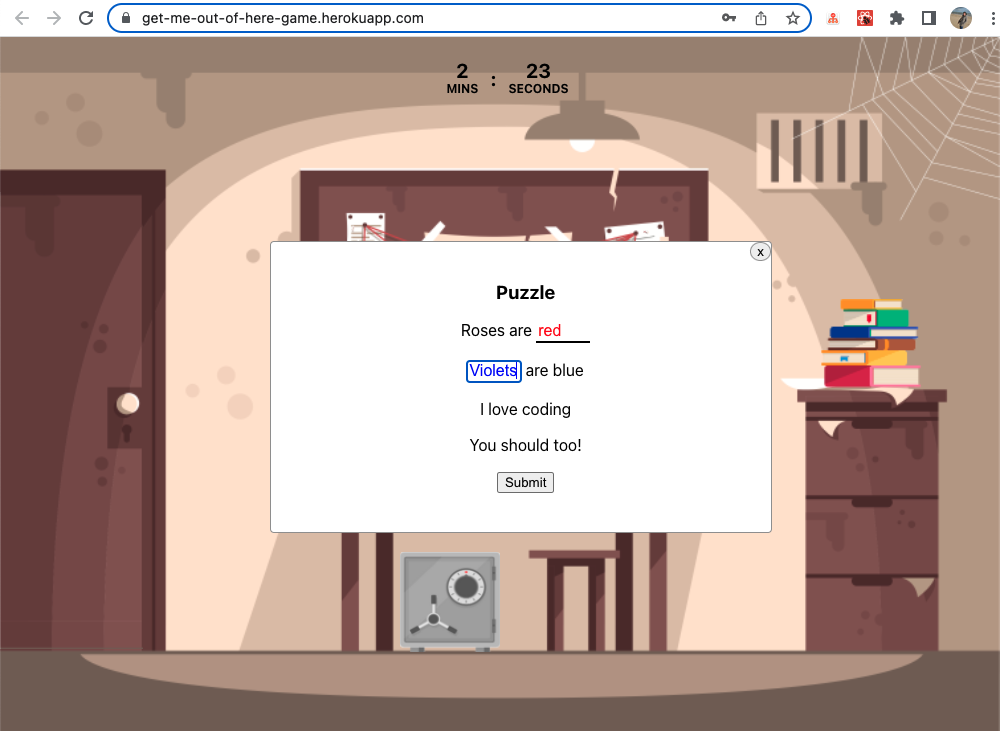
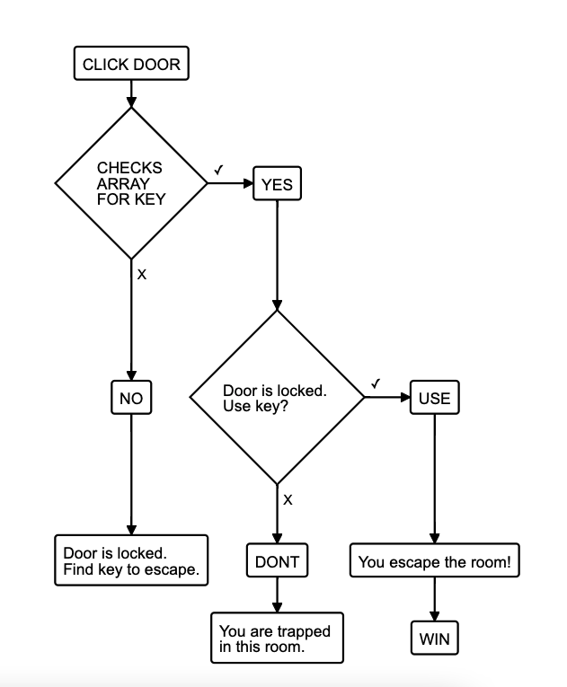
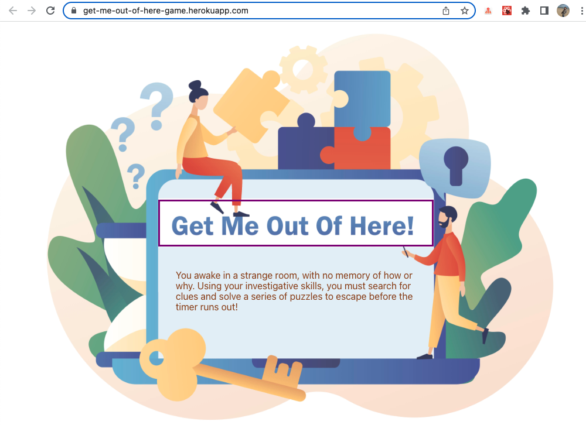
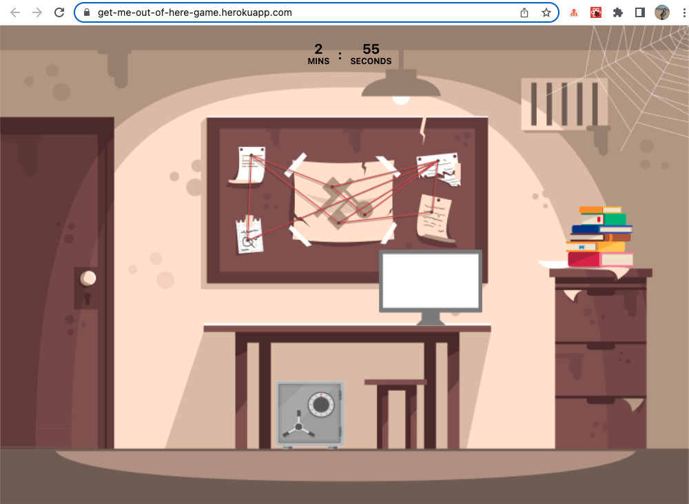
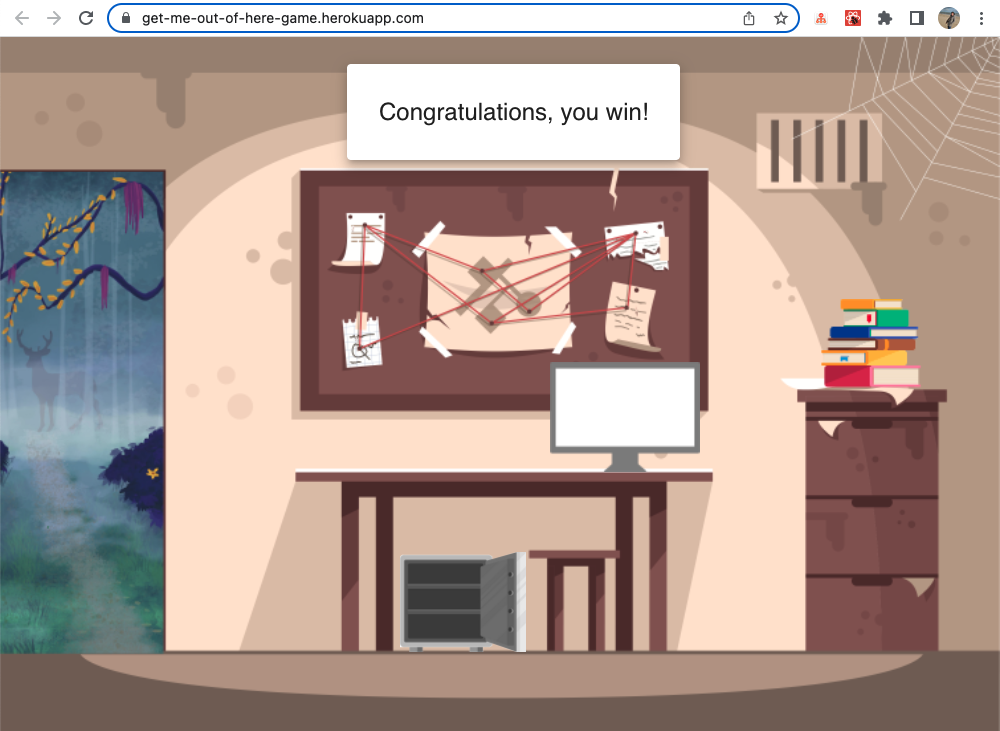

### Escape-room

# Project Description

**An escape room game where you collect clues and solve puzzles to complete the mystery, within a limited timeframe, all from your browser.**

This is a Makers Academy final project created in two weeks by the following: [Ali](https://github.com/AliCo-Hash), [Ben](https://github.com/benpartington), [Charlotte](https://github.com/CBuchan5), [Marie](https://github.com/mmguinness), [Rakshak](https://github.com/Rakshak81).

# How to play

Link to game: https://get-me-out-of-here-game.herokuapp.com/

- Hover over page elements to interact 
- Type in answers to complete puzzles
- Find the key to be able to escape the room
- You have three minutes to escape or the game ends

# Tech

This is a front-end only game. We wanted to push ourselves to learn a new technology which was appropriate to the type of game-play we wanted to achieve - interactive and quick-loading.

- JavaScript
- NodeJS 
- ReactJS
- MaterialUI: react component library
- React Testing Library: Integration testing
- HTML / CSS: For visual styling

# MVP

# Screenshots of gameplay

